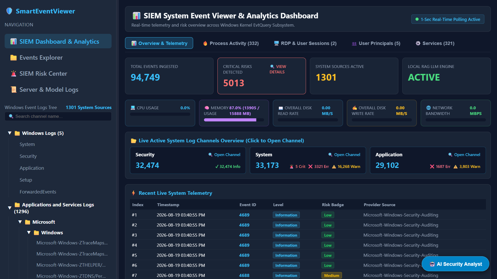
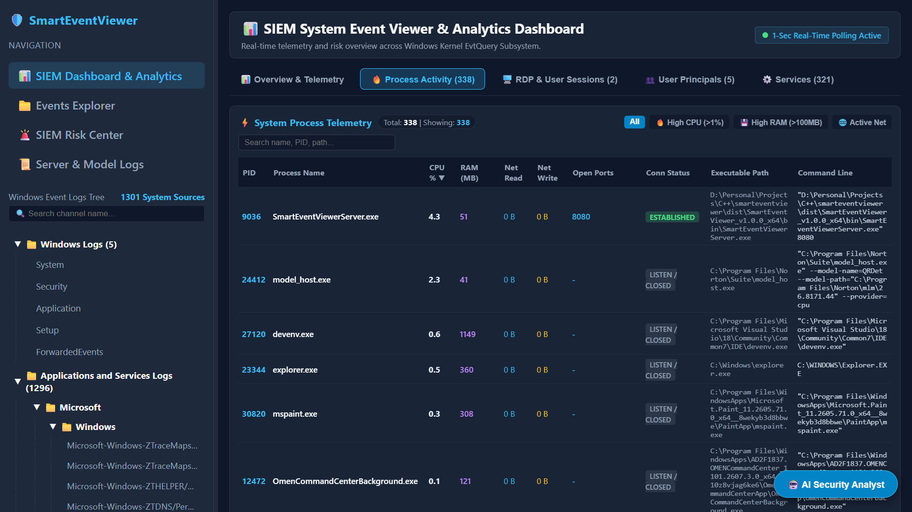
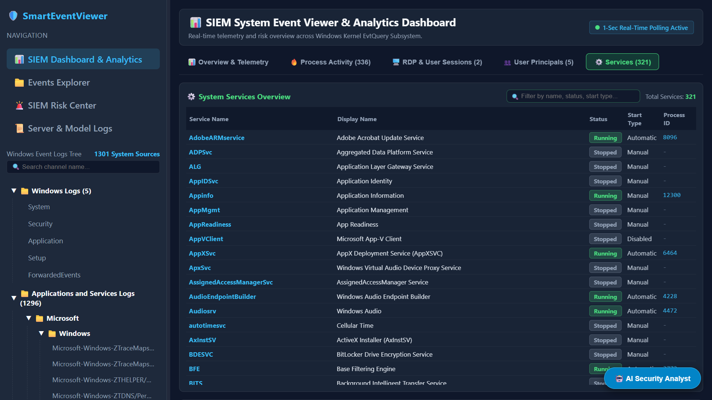
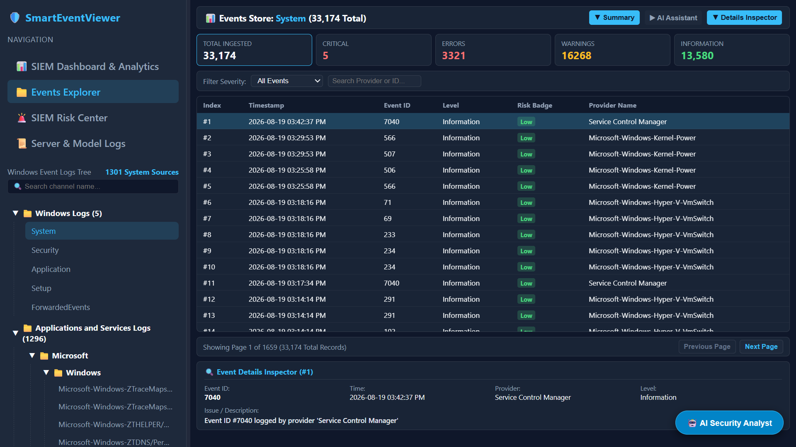
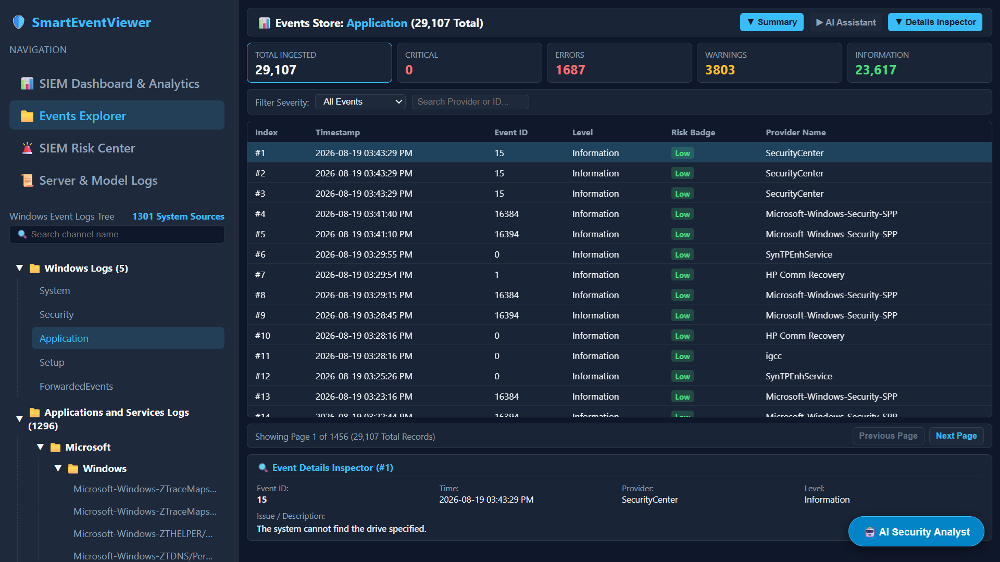
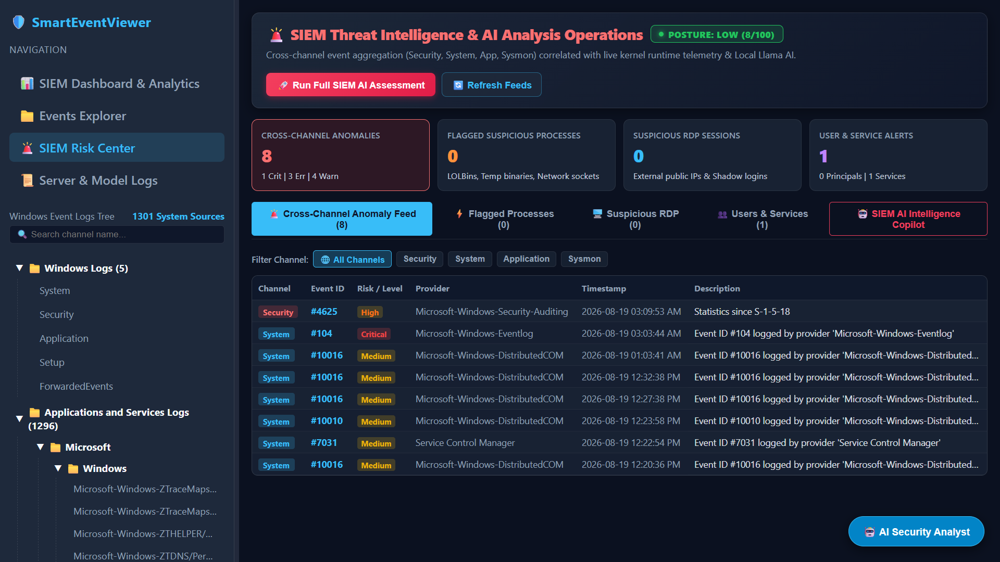
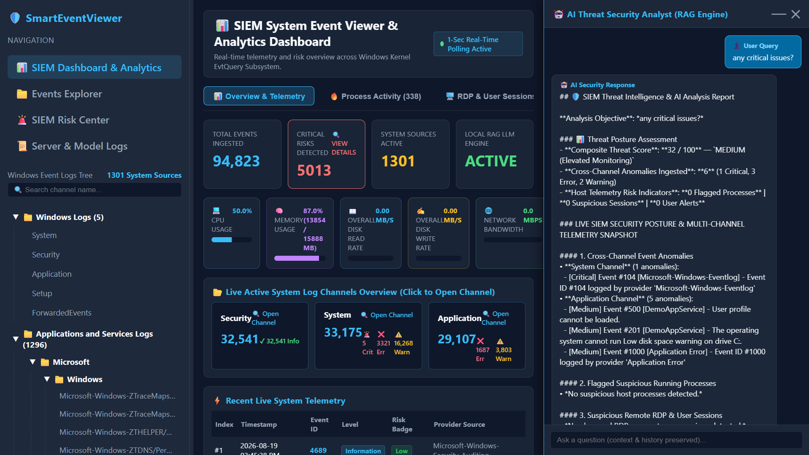
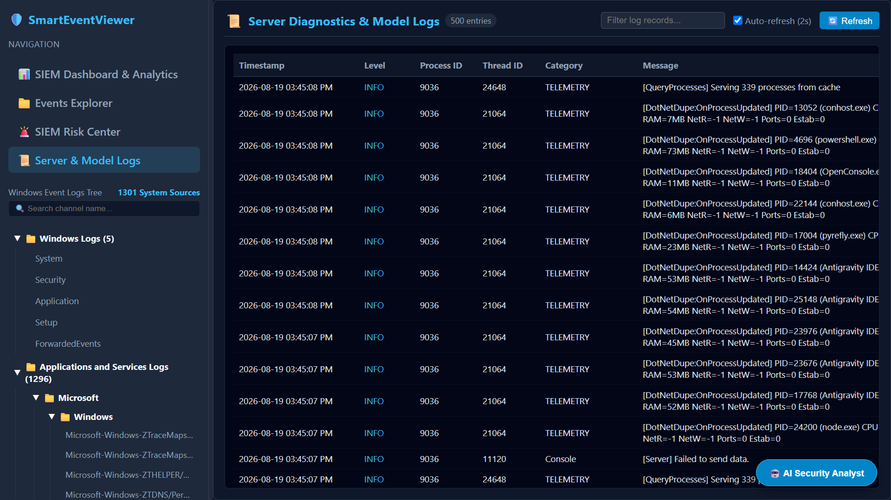
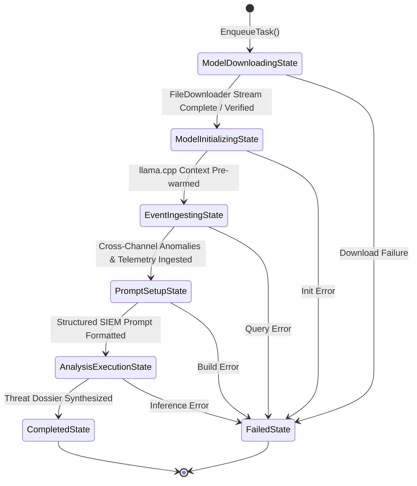

# 🛡️ SmartEventViewer

<div align="center">


**High-Performance Native C++17 SIEM, Windows Event Log Analyzer & Telemetry Dashboard with Embedded Local RAG AI Security Analyst**

*Built on top of the high-performance **DotNetDupe** C++ foundational infrastructure library.*

[Quick Start](#-quick-start--installation) • [Key Features](#-key-features) • [Built on DotNetDupe](#️-built-on-dotnetdupe-infrastructure) • [Server Hosting Code](#-server-hosting--dependency-injection-in-maincpp) • [Screenshots](#-screenshots--walkthrough) • [Architecture](#-architecture--tech-stack) • [Building from Source](#-building-from-source) • [References](#-references)

</div>

---

## 📖 Table of Contents
- [✨ Key Features](#-key-features)
- [⚙️ Built on DotNetDupe Infrastructure](#️-built-on-dotnetdupe-infrastructure)
- [💻 Server Hosting & Dependency Injection in `main.cpp`](#-server-hosting--dependency-injection-in-maincpp)
- [🖼️ Screenshots & Walkthrough](#-screenshots--walkthrough)
  - [1. SIEM Analytics & Telemetry Dashboard](#1-siem-analytics--telemetry-dashboard)
  - [2. Real-Time Process Telemetry & Progressive Inspection](#2-real-time-process-telemetry--progressive-inspection)
  - [3. Windows System Services Manager](#3-windows-system-services-manager)
  - [4. Multi-Channel Events Explorer](#4-multi-channel-events-explorer)
  - [5. SIEM Risk Center & Threat Posture Breakdown](#5-siem-risk-center--threat-posture-breakdown)
  - [6. Local RAG AI Threat Security Analyst](#6-local-rag-ai-threat-security-analyst)
  - [7. Structured Diagnostic Server Logs](#7-structured-diagnostic-server-logs)
- [🏗️ Architecture & Tech Stack](#-architecture--tech-stack)
- [🚀 Quick Start & Installation](#-quick-start--installation)
- [🤖 On-Demand AI Model Auto-Download](#-on-demand-ai-model-auto-download)
- [🔨 Building from Source](#-building-from-source)
  - [Prerequisites](#prerequisites)
  - [Build via MSBuild (Visual Studio)](#build-via-msbuild-visual-studio)
  - [Build via CMake](#build-via-cmake)
- [📦 Packaging Standalone Release](#-packaging-standalone-release)
- [📚 References](#-references)
  - [DotNetDupe Framework](#dotnetdupe-framework)
  - [Architecture & Design Strategy](#architecture--design-strategy)
    - [1. The Thoughts Behind the Dashboard](#1-the-thoughts-behind-the-dashboard)
    - [2. Risk Center & Threat Score Calculation Algorithm](#2-risk-center--threat-score-calculation-algorithm)
    - [3. How Event Analysis Works Under the Hood (Local RAG + GGUF)](#3-how-event-analysis-works-under-the-hood-local-rag--gguf)
    - [4. How Events Summary and Listing Works (Native ETW & Winevt)](#4-how-events-summary-and-listing-works-native-etw--winevt)
    - [5. Logging Strategy & Real-Time Log Viewer](#5-logging-strategy--real-time-log-viewer)
- [📄 License](#-license)

---

## ✨ Key Features

- **⚡ Native Windows ETW & Evt Engine**: High-throughput asynchronous ingestion of Windows Event Logs (`Security`, `System`, `Application`, `Sysmon`, `PowerShell`, `TaskScheduler`, `TerminalServices`, etc.).
- **📊 Real-Time Hardware & Telemetry Dashboard**: Live streaming CPU load, Physical RAM utilization, Disk I/O MB/s throughput, Network Mbps, active Windows user logons, system accounts, and RDP sessions.
- **🔄 Progressive Two-Tier Process Streamer**: Instantaneous discovery (`<5ms`) with progressive background metric enrichment for per-process CPU %, Working Set Memory, Network Read/Write bytes, open listening ports, and socket connection states.
- **🚨 Advanced Threat Scoring & Anomaly Engine**: Dynamic heuristic risk scoring engine detecting brute-force authentication attacks (Event ID 4625), privilege escalations (Event ID 4672/4673), suspicious hidden services, and unmapped administrative activities.
- **🤖 Embedded Offline RAG AI Security Analyst with State Pattern Pipeline**: Zero-cloud, private on-device LLM inference powered by `llama.cpp` (Qwen GGUF) and an in-memory vector store. Architected around a pure GoF State Pattern (`AnalysisService`) with real-time DotNetDupe `EventHandler` status and progress streaming.
- **🌐 Modern Glassmorphism Web Interface**: Premium React 19 + TypeScript dark-mode SIEM dashboard operating over ultra-low-latency WebSockets (`/ws/telemetry`) and REST endpoints.
- **📋 Forensic Exporter & Structured Log Viewer**: Export event logs and threat dossiers to EVTX / JSON, and inspect live structured server diagnostic logs.

---

## ⚙️ Built on DotNetDupe Infrastructure

SmartEventViewer is architected entirely on top of the **`DotNetDupe`** C++ infrastructure library from NuGet, ensuring strict RAII memory management, high-performance collections, and unified system telemetry:

- **Web Application Server & Dependency Injection**: Utilizes `DotNetDupe::WebAppCore::Server::WebAppServer` and `DotNetDupe::WebAppCore::Builder::WebApplication` with a full-featured Inversion of Control (IoC) container (`AddSingleton<T>`, `AddTransient<T>`), strongly-typed REST routing (`MapGet`, `MapPost`), WebSocket endpoints (`MapWebSocket`), and static file serving (`EnableStaticFiles`).
- **Event-Driven Architecture & Delegates**: Leverages `DotNetDupe::System::EventHandler<T>` and `EventArgs` across background processes, process streams (`ProcessStreamer`), file downloads (`FileDownloader`), and AI analysis lifecycle notifications (`AnalysisService`).
- **System Diagnostics & Progressive Telemetry**: Uses `DotNetDupe::System::Diagnostics::SystemMetrics`, `ProcessStreamer`, `ActiveUserSession`, `TerminalSession`, and `ServiceInfo` for non-blocking real-time process enumeration, socket table inspection, and system metrics.
- **Memory & Object Management**: Exclusively utilizes `DotNetDupe::System::SmartPointer<T>` and reference-counted object hierarchies with zero raw pointer manipulation.
- **High-Performance Collections**: Employs `DotNetDupe::System::Collections::Generic::List<T>`, `Dictionary<TKey, TValue>`, and `HashSet<T>`.
- **Threading, Synchronization & Tasks**: Powers asynchronous request handling and event watchers via `DotNetDupe::System::Threading::Tasks::Task`, `Thread`, `CriticalSection`, and `Lock`.
- **HTTP Engine & File Downloader**: Uses `DotNetDupe::System::Net::Http::FileDownloader` for asynchronous, resilient chunk-based downloading of HuggingFace GGUF model weights with byte-level progress reporting via `DownloadProgressChanged`.
- **Structured Enterprise Logging**: Implements `DotNetDupe::Extensions::Logging::LoggerFactory`, `FileLoggerProvider`, and `ConsoleLoggerProvider` for diagnostic telemetry and server auditing.

---

## 💻 Server Hosting & Dependency Injection in `main.cpp`

The backend REST API, WebSocket streams, and static SPA frontend are hosted natively in C++ using DotNetDupe's `WebApplicationBuilder`, `WebApplication`, and `WebAppServer`. 

The following snippet from [`SmartEventViewerServer/main.cpp`](SmartEventViewerServer/main.cpp) illustrates how services are registered with the IoC container, routes are mapped, and the server is launched:

```cpp
#include "WebAppCore/Builder/WebApplication.h"
#include "WebAppCore/Builder/WebApplicationBuilder.h"
#include "WebAppCore/Server/WebAppServer.h"

using namespace DotNetDupe::System;
using namespace DotNetDupe::WebAppCore::Builder;
using namespace DotNetDupe::WebAppCore::Server;

int main(int argc, char* argv[]) {
    try {
        ConfigureLogging();
        WebApplicationBuilder builder;
        
        // 1. Dependency Injection: Register Singletons & Services
        SmartPointer<SmartEventViewer::TelemetryWebSocketHandler> spPushNotifier;
        SmartPointer<SmartEventViewer::ITelemetryService> spTelemetryService;
        
        spPushNotifier = SmartPointer<SmartEventViewer::TelemetryWebSocketHandler>::NewShared();
        builder.GetServices().AddSingleton<SmartEventViewer::ITelemetryPushNotifier>(spPushNotifier);
        builder.GetServices().AddSingleton<SmartEventViewer::IEventLogReader, SmartEventViewer::WindowsEtwLogReader>();
        builder.GetServices().AddSingleton<SmartEventViewer::ISystemTelemetryProvider, SmartEventViewer::WindowsSystemTelemetryProvider>();
        builder.GetServices().AddSingleton<SmartEventViewer::IAnomalyEngine, SmartEventViewer::AnomalyEngine>();
        builder.GetServices().AddSingleton<SmartEventViewer::LocalLlmEngine, SmartEventViewer::LocalLlmEngine>();
        builder.GetServices().AddSingleton<SmartEventViewer::IEventService, SmartEventViewer::EventService>();
        builder.GetServices().AddSingleton<SmartEventViewer::IAnalysisService>(SmartEventViewer::AnalysisService::GetSharedInstance());

        // 2. Register REST API Controllers
        builder.GetServices().AddTransient<SmartEventViewer::EventsController>();
        builder.GetServices().AddTransient<SmartEventViewer::TelemetryController>();
        builder.GetServices().AddTransient<SmartEventViewer::LlmAnalysisController>();
        builder.GetServices().AddTransient<SmartEventViewer::DiagnosticsController>();

        builder.AddController<SmartEventViewer::EventsController>("/api")
            .MapGet("/channels", &SmartEventViewer::EventsController::GetChannels)
            .MapGet("/events/summary", &SmartEventViewer::EventsController::GetEventSummary)
            .MapGet("/events", &SmartEventViewer::EventsController::GetEvents)
            .MapGet("/events/anomalies", &SmartEventViewer::EventsController::GetAnomalies);

        builder.AddController<SmartEventViewer::TelemetryController>("/api")
            .MapGet("/metrics/summary", &SmartEventViewer::TelemetryController::GetSummary)
            .MapGet("/metrics/processes", &SmartEventViewer::TelemetryController::GetProcesses)
            .MapGet("/metrics/sessions", &SmartEventViewer::TelemetryController::GetSessions)
            .MapGet("/metrics/services", &SmartEventViewer::TelemetryController::GetServices)
            .MapGet("/metrics/posture", &SmartEventViewer::TelemetryController::GetPosture);

        // 3. Build WebApplication & Configure WebSocket Endpoints
        auto app = builder.Build();
        app->MapWebSocket("/ws/telemetry", spPushNotifier);
        app->MapControllers();

        // 4. Configure WebAppServer for Static SPA Hosting + REST API
        String sWebRoot = Path::Combine({ Path::GetFullPath("."), "UI" });
        auto webServer = SmartPointer<WebAppServer>::New(app, sWebRoot);
        webServer->EnableStaticFiles("index.html");

        // 5. Start Real-Time Background Telemetry Worker & Run Server
        SmartEventViewer::TelemetryBackgroundWorker::Start(spTelemetryService);
        webServer->Run("http://127.0.0.1:8080");
        Console::Read();
    } catch (const DotNetDupe::System::Exception& ex) {
        Console::WriteLine("[SERVER_FATAL] DotNetDupe Exception: {0}", ex.What());
    }
    return 0;
}
```

---

## 🖼️ Screenshots & Walkthrough

### 1. SIEM Analytics & Telemetry Dashboard
Real-time summary gauges for CPU, RAM, Disk I/O, Network bandwidth, channel aggregates, and critical event breakdowns.



---

### 2. Real-Time Process Telemetry & Progressive Inspection
Dynamic multi-column sorting and filtering across all running processes with PID-bound CPU %, RAM (MB), Network throughput, open ports, and connection status.



---

### 3. Windows System Services Manager
Comprehensive status inspection of all installed Windows services, display names, start types, and process ID bindings.



---

### 4. Multi-Channel Events Explorer
Tree-based Windows event log exploration with real-time level filtering, full event record inspection, and raw XML formatting.

| System Channel | Application Channel |
| :---: | :---: |
|  |  |

---

### 5. SIEM Risk Center & Threat Posture Breakdown
Mathematically bounded threat scoring (0–100), MITRE ATT&CK categorization, and categorized breakdown of flagged processes, suspicious sessions, locked users, and unknown services.



---

### 6. Local RAG AI Threat Security Analyst
Interactive on-device AI security assistant providing deep cross-channel incident summaries and threat assessments. Automatically downloads GGUF weights on-demand with live percentage feedback.



---

### 7. Structured Diagnostic Server Logs
Live tabular stream of native backend engine logs with category filtering, timestamps, process IDs, and thread IDs.



---

## 🏗️ Architecture & Tech Stack

```
┌────────────────────────────────────────────────────────────────────────────────────────┐
│                                 SmartEventViewer App                                   │
│                        (React 19 + TypeScript + Vite Dashboard)                        │
└──────────────────────────────────────────┬─────────────────────────────────────────────┘
                                           │  WebSocket (/ws/telemetry) & REST API
┌──────────────────────────────────────────▼─────────────────────────────────────────────┐
│                              SmartEventViewer Server                                   │
│            (C++17 Embedded HTTP REST API, Static Web Server & WebSocket Engine)         │
└──────────────────────────────────────────┬─────────────────────────────────────────────┘
                                           │
┌──────────────────────────────────────────▼─────────────────────────────────────────────┐
│                              SmartEventViewer Core                                     │
│  ├── WindowsEtwLogReader (Winevt Native Kernel Queries & EvtFormatMessage)             │
│  ├── SystemTelemetryProvider (Progressive ProcessStreamer, Sessions, Hardware Gauges)  │
│  ├── AnomalyEngine (Cross-Channel Risk Correlator & Threat Scorer)                     │
│  ├── LocalLlmEngine (llama.cpp Offline Inference Engine + HuggingFace Auto-Downloader) │
│  └── RagVectorStore (In-Memory Vector Search & Retrieval Context Assembler)            │
└──────────────────────────────────────────┬─────────────────────────────────────────────┘
                                           │
┌──────────────────────────────────────────▼─────────────────────────────────────────────┐
│                                DotNetDupe Runtime                                      │
│         (System::Diagnostics, Threading, Collections, SmartPointer, Networking)         │
└────────────────────────────────────────────────────────────────────────────────────────┘
```

---

## 🚀 Quick Start & Installation

No complex configuration or runtime dependencies required. Everything is bundled in a portable standalone package.

1. **Download Release Archive**:
   Download the latest `SmartEventViewer-windows-x64.zip` from the [GitHub Releases](https://github.com/sudheeshps/smarteventviewer/releases) page.
2. **Extract**:
   Extract the archive to any folder on your Windows machine.
3. **Launch**:
   Double-click `start_smarteventviewer.bat`.
   - The launcher requests Administrator elevation (required to read restricted Windows Security event logs).
   - Starts the native C++ server in the background on port `8080`.
   - Automatically opens the SIEM Dashboard in your default web browser at `http://127.0.0.1:8080/`.

---

## 🤖 On-Demand AI Model Auto-Download

SmartEventViewer delivers offline privacy-first AI threat analysis without requiring multi-gigabyte models in the initial download:
1. When you first ask a question in the **AI Security Analyst** drawer or click **Analyze Events**, the server checks for `models/Qwen1.5-4B-Chat-Q4_K_M.gguf`.
2. If the model file is not present, the backend automatically initiates a secure download of the GGUF model weights from HuggingFace.
3. The UI displays an animated download progress bar with live download speed (MB/s) and completion percentage.
4. Once completed, the model is cached in `models/` for instant offline inference in all future queries.

---

## 🔨 Building from Source

### Prerequisites
- **Operating System**: Windows 10/11 or Windows Server (x64)
- **Compiler**: Visual Studio 2022 (v143 toolset with C++17 support)
- **Node.js**: v18+ (for building React frontend)
- **NuGet**: For restoring `DotNetDupe` framework dependencies

### Build via MSBuild (Visual Studio)
```powershell
# 1. Clone repository
git clone https://github.com/sudheeshps/smarteventviewer.git
cd smarteventviewer

# 2. Build Frontend
cd SmartEventViewerApp
npm ci
npm run build
cd ..

# 3. Build C++ Release Binaries
.\build_msbuild.bat release rebuild

# 4. Run Unit Tests
.\bin\x64\Release\SmartEventViewerTests.exe
```

### Build via CMake
```powershell
# Build Release using CMake script
.\build_cmake.bat release rebuild
```

---

## 📦 Packaging Standalone Release

To produce a clean, production-ready portable ZIP release:
```powershell
.\package_release.bat
```
This builds the native C++ binaries, compiles the React SPA, copies all dynamic runtime DLLs (`DotNetDupe.dll`, `libcrypto-4-x64.dll`, `libssl-4-x64.dll`, `llama.dll`, `ggml.dll`), creates the UAC launcher, and generates `dist/SmartEventViewer_v1.0.0_x64.zip`.

---

## 📚 References

### DotNetDupe Framework
- 🌐 **[DotNetDupe Official API Documentation](https://sudheeshps.github.io/dotnetdupe/)** — Comprehensive class reference, guides, and API specifications.
- 📦 **[DotNetDupe on NuGet](https://www.nuget.org/packages/DotNetDupe/)** — Native C++ foundational infrastructure package.

### Architecture & Design Strategy

Detailed design guides and technical specifications:
- 📄 **[AnalysisService State Pattern & EventHandler Architecture](docs/AnalysisServiceStatePattern.md)** — Architectural design of the pure GoF State Pattern, event-driven state transitions, and decoupled progress streaming.
- 📄 **[LocalLlmEngine & RAG Guide](docs/LocalLlmAndRagGuide.md)** — Architectural design of the on-device RAG vector retrieval pipeline and GGUF llama inference engine.

---

#### 1. The Thoughts Behind the Dashboard
The traditional Windows Event Viewer (`eventvwr.msc`) is synchronous, prone to UI freezes under heavy log volume, and operates in isolation from host hardware telemetry.

SmartEventViewer bridges this gap by unifying host metrics and event streams into a single live SIEM command center:
- **Zero UI-Thread Freezing**: Telemetry polling and WebSocket streaming are offloaded to a dedicated background Web Worker (`telemetry.worker.ts`). Event bursts do not stutter UI interactions or table scrolling.
- **Progressive Two-Tier Streaming**: DotNetDupe's `ProcessStreamer` splits process discovery into **Tier 1 Fast Discovery** ($<5\text{ms}$ for instantaneous total process counts and basic metadata) and **Tier 2 Deep Metric Enrichment** (asynchronously calculating CPU deltas, memory working sets, socket tables, and open ports in the background).
- **Sub-Tab Modularity**: The dashboard provides immediate pivot views across **Hardware Overview**, **Running Processes**, **Active Logon Sessions**, **System Users & Privilege Classes**, **RDP Remote Connections**, and **Windows SCM Services**.
- **Client-Side Dynamic Sorting & Filtering**: The entire running process list is held in memory on the client, allowing instant $0\text{ms}$ multi-column sorting (by CPU %, Memory MB, Network Read/Write, Port) without triggering server round-trips.

---

#### 2. Risk Center & Threat Score Calculation Algorithm
The SIEM Risk Center correlates multi-channel event streams and real-time host telemetry to calculate a mathematically bounded **Threat Score ($0 \le \text{Score} \le 100$)** and determine an **Overall Risk Tier** (`LOW`, `MEDIUM`, `HIGH`, `CRITICAL`):

$$\text{ThreatScore} = \min\left(100.0, \, \sum \text{AnomalyWeights}\right)$$

##### Threat Vector Weights Breakdown:
- **Brute-Force / Authentication Failures (Event ID 4625)**: $+12.0$ points per detected incident.
- **Privilege Escalations / Special Privileges Assigned (Event ID 4672 / 4673)**: $+15.0$ points per incident.
- **Unauthorized / Suspicious Process Executions**: $+8.0$ points per process exhibiting anomalous command lines or high resource consumption.
- **Unregistered / Suspicious Services**: $+6.0$ points per newly installed or unmapped system service.
- **Unusual Open Port / Listening Socket Bindings**: $+4.0$ points per process binding unexpected network listening ports.
- **Account Lockouts & Security Policy Violations**: $+10.0$ points per locked administrative account.

##### MITRE ATT&CK Mapping
The `AnomalyEngine` automatically categorizes detected threat vectors into standardized MITRE ATT&CK techniques:
- **T1110 (Brute Force)**: Multiple failed logons across short timeframes.
- **T1078 (Valid Accounts)**: Anomalous administrative logons during non-standard hours.
- **T1068 (Privilege Escalation)**: Token impersonation and privileged service execution.
- **T1569 (System Services)**: Service execution and daemon manipulation.
- **T1059 (Command and Scripting Interpreter)**: Unsigned PowerShell and WMI activity.

---

#### 3. How Event Analysis Works Under the Hood (Local RAG + GGUF & GoF State Pattern)
SmartEventViewer coordinates offline AI threat analysis using a **pure GoF State Pattern** within `AnalysisService`, combined with an in-memory RAG vector index and `llama.cpp` local inference:



1. **State Machine Context (`AnalysisService`)**: `AnalysisService` holds the active state object reference (`m_spCurrentState`) and public `EventHandler` delegates (`StateChanged`, `ProgressChanged`).
2. **Decoupled Event Model**:
   - `AnalysisStateChangedEventArgs` transports discrete lifecycle transitions (`DOWNLOADING` -> `INITIALIZING` -> `PROCESSING` -> `COMPLETED` / `FAILED`) and terminal payloads.
   - `AnalysisProgressChangedEventArgs` encapsulates live progress metrics with polymorphic `SmartPointer<EventArgs>` details (e.g. `DownloadProgressChangedEventArgs` for byte-level streaming rates).
3. **On-Demand Model Provisioning (`ModelDownloadingState`)**: If `models/Qwen1.5-4B-Chat-Q4_K_M.gguf` is missing, `DotNetDupe::System::Net::Http::FileDownloader` streams weights from HuggingFace with live byte % and MB/s progress.
4. **Context Pre-warming & Multi-Channel Ingestion (`ModelInitializingState` & `EventIngestingState`)**: Pre-warms the quantized model backend and aggregates critical events across Security, System, Application, and Sysmon channels alongside live host telemetry posture.
5. **SIEM Threat Synthesis (`PromptSetupState` & `AnalysisExecutionState`)**: Formats the RAG context and runs local quantized inference (Q4_K_M) on CPU/GPU without transmitting any data over the network.
6. **Task Completion (`CompletedState`)**: Publishes the final analysis report and updates the REST/WebSocket cache for client UI consumption.

---

#### 4. How Events Summary and Listing Works (Native ETW & Winevt)
Windows Event log ingestion is built directly on the native Windows Event Log API (`winevt.dll`):

- **Fast Metadata Summaries (`/api/events/summary`)**:
  - Rather than reading millions of XML records into memory, the backend queries channel metadata and event bookmarks to aggregate total record counts and severity distributions (Critical, Error, Warning, Information, Verbose) in milliseconds.
- **Indexed Paged Listing (`/api/events?channel=...&page=N&pageSize=20`)**:
  - Uses native `EvtQuery` handles with reverse chronological traversal (`EvtQueryChannelPath | EvtQueryReverseDirection`).
  - Evaluates XPath filters on the kernel side (e.g. `*[System[(Level=1 or Level=2)]]`) before passing records to user-space.
- **Message Rendering & XML Extraction**:
  - Employs `EvtFormatMessage` with provider publisher metadata caches to resolve parameterized string templates into human-readable descriptions while preserving raw event XML payloads for deep forensic export.

---

#### 5. Logging Strategy & Real-Time Log Viewer
Diagnostic telemetry and server health monitoring are structured through DotNetDupe's logging infrastructure:

- **Structured Log Formatting**: All server subsystems (`SERVER`, `TELEMETRY`, `EVT_SERVICE`, `ANOMALY`, `AI_ENGINE`) log structured entries containing timestamps, severity levels, process IDs, thread IDs, category tags, and descriptive messages.
- **Automated Size Rollover**: `LoggerConfiguration` enforces file rollover (e.g., maximum 5 MB per log file with 5 backup archives) at `logs/SmartEventViewerServer.log` to prevent disk exhaustion on production servers.
- **Live In-Browser Viewer**: The **Server Logs Viewer** tab (`/api/logs/format` & `/api/logs`) streams native backend logs directly into a sortable, filterable in-browser log table with category search and real-time auto-refresh.

---

## 📄 License

SmartEventViewer is licensed under the [MIT License](LICENSE).
