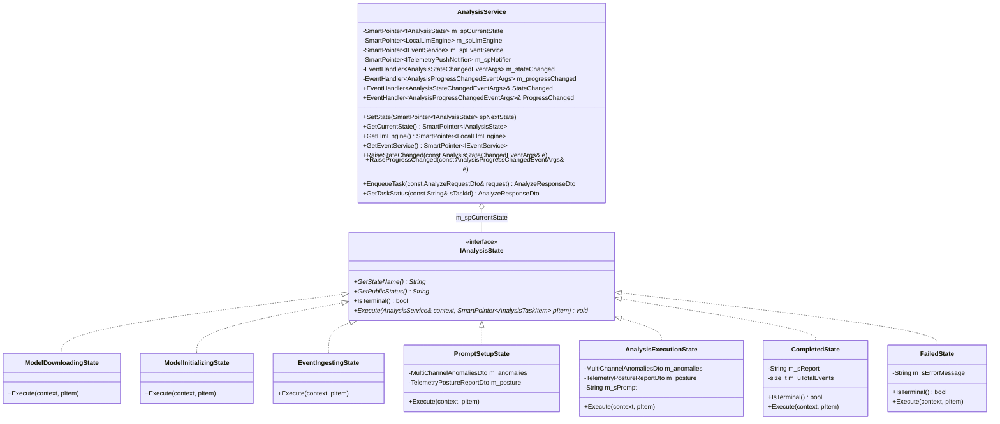
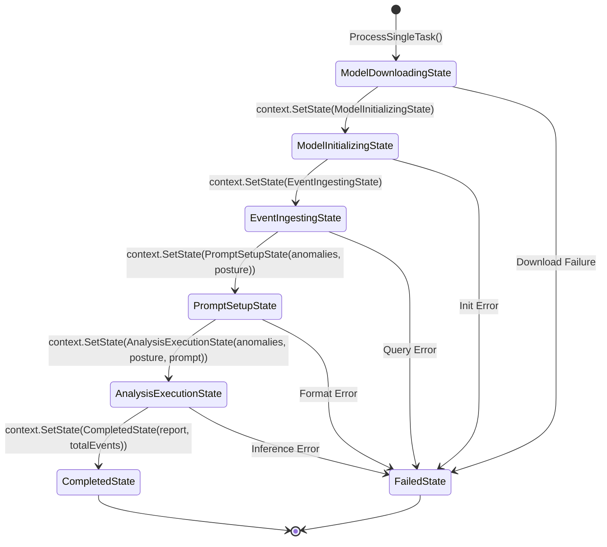

# AnalysisService Event-Driven State Pattern Architecture

## Overview
`AnalysisService` coordinates the multi-stage AI threat analysis pipeline in SmartEventViewer. To ensure clean separation of concerns, robust progress publishing, and extensibility, the pipeline is architected around the **GoF State Pattern** combined with DotNetDupe's **`EventHandler`** delegate system.

---

## Architecture



---

## State Transition Pipeline



---

## Pipeline States Description

| State Class | Emitted Status | Action | Next Transition |
| :--- | :--- | :--- | :--- |
| **`ModelDownloadingState`** | `DOWNLOADING` | Checks if `models/Qwen1.5-4B-Chat-Q4_K_M.gguf` exists locally. If missing, streams weights via `FileDownloader` from HuggingFace and emits `ProgressChanged` events with wrapped `DownloadProgressChangedEventArgs` details. | `ModelInitializingState` (or `FailedState` on download error) |
| **`ModelInitializingState`** | `INITIALIZING` | Pre-warms `llama.cpp` context and initializes quantized GGUF weights. | `EventIngestingState` |
| **`EventIngestingState`** | `PROCESSING` | Queries `IEventService::GetCrossChannelAnomalies` across Security, System, App, and Sysmon channels alongside live host telemetry posture. | `PromptSetupState(anomalies, posture)` |
| **`PromptSetupState`** | `PROCESSING` | Formats SIEM threat framing and constructs structured system prompt using `LocalLlmEngine::FormatSiemContext`. | `AnalysisExecutionState(anomalies, posture, prompt)` |
| **`AnalysisExecutionState`** | `PROCESSING` | Performs AI threat report generation / LLM inference using `LocalLlmEngine::FormatSiemThreatReport`. | `CompletedState(report, totalEvents)` |
| **`CompletedState`** | `COMPLETED` | Marks task as terminal (`IsTerminal() == true`), packages final `AnalyzeResponseDto`, and raises terminal `StateChanged`. | Terminal |
| **`FailedState`** | `FAILED` | Marks task as terminal (`IsTerminal() == true`), records error diagnostics, and raises terminal `StateChanged`. | Terminal |

---

## Decoupled Event System

The architecture unifies all event reporting into two core event arguments:

### 1. `AnalysisStateChangedEventArgs`
Raised on every discrete state transition and upon terminal completion/failure:
- **`TaskId`**: Unique identifier for the analysis task.
- **`PreviousState`**: Name of previous state (e.g. `"ModelDownloading"`).
- **`NewState`**: Name of active state (e.g. `"ModelInitializing"`).
- **`Status`**: High-level status string for UI binding (`"DOWNLOADING"`, `"INITIALIZING"`, `"PROCESSING"`, `"COMPLETED"`, `"FAILED"`).
- **`ProgressMessage`**: Human-readable milestone message.
- **`GetResponse()`**: Final `AnalyzeResponseDto` payload (when reaching terminal state).
- **`IsTerminal()`**: Boolean indicating if pipeline execution has finished.

### 2. `AnalysisProgressChangedEventArgs`
Raised during intra-state continuous progress updates (e.g., chunk downloads or batch event streaming):
- **`TaskId`**: Task identifier.
- **`ProgressPercentage`**: Universal 0.0–100.0 progress indicator.
- **`ProgressMessage`**: Descriptive progress text (e.g. `"Downloading model: 45% (450 MB / 1000 MB)"`).
- **`GetDetailsAs<T>()`**: Polymorphic extraction of encapsulated detail objects (e.g. `DownloadProgressChangedEventArgs`) without coupling `AnalysisEvents.h` to networking headers.

---

## Client Subscription Example

```cpp
#include "Core/AnalysisService.h"
#include "System/Console.h"

using namespace SmartEventViewer;
using namespace DotNetDupe::System;

void MonitorAnalysis() {
    auto spService = AnalysisService::GetSharedInstance();

    // 1. Subscribe to discrete state changes
    spService->StateChanged += [](const void* pSender, const AnalysisStateChangedEventArgs& e) {
        Console::WriteLine("[STATE] Task {0}: {1} -> {2} [{3}]", 
            e.GetTaskId(), e.GetPreviousState(), e.GetNewState(), e.GetStatus());
        if (e.IsTerminal()) {
            Console::WriteLine("[COMPLETED] Final Report Length: {0}", e.GetResponse().Analysis.GetLength());
        }
    };

    // 2. Subscribe to continuous progress updates
    spService->ProgressChanged += [](const void* pSender, const AnalysisProgressChangedEventArgs& e) {
        Console::WriteLine("[PROGRESS] {0}% - {1}", e.GetProgressPercentage(), e.GetProgressMessage());
        
        // Extract optional download details type-safely
        auto spDl = e.GetDetailsAs<DotNetDupe::System::Net::Http::DownloadProgressChangedEventArgs>();
        if (!spDl.IsNull()) {
            Console::WriteLine("  Rate: {0} B/s | Downloaded: {1}/{2} bytes",
                spDl->GetDownloadRateBytesPerSec(), spDl->GetBytesReceived(), spDl->GetTotalBytesToReceive());
        }
    };

    // 3. Enqueue Analysis Request
    AnalyzeRequestDto request;
    request.Channel = "Security";
    request.Query = "Detect potential brute force authentication spikes";
    auto response = spService->EnqueueTask(request);
}
```
