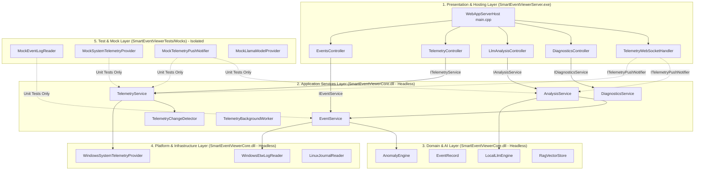

# SmartEventViewer Backend Architecture & Design Document

## 1. Architectural Overview

SmartEventViewer backend is designed around a **Clean N-Tier Layered Architecture with Full Dependency Injection (DI)**, powered by **DotNetDupe 4.0.1**.

In this architecture, **`SmartEventViewerCore.dll`** is a **pure headless core library** containing zero HTTP/Web framework dependencies. The Web API Controllers and WebSocket handlers reside strictly in the hosting application **`SmartEventViewerServer.exe`**.



---

## 2. Project & Binary Boundaries (Headless Core + Server Architecture)

### Project 1: `SmartEventViewerCore` (`.dll` / `.lib`)
A pure, headless domain and service library with **no Web/HTTP dependencies**:
- **Application Services**:
  - `EventService` (`IEventService`): Manages 10-entry LRU cache, event pagination, severity filtering, and summary calculations.
  - `TelemetryService` (`ITelemetryService`): Manages metric TTL caching, delta change detection, and push triggering.
  - `TelemetryChangeDetector`: In-memory state diffing engine comparing successive snapshots against delta thresholds.
  - `TelemetryBackgroundWorker`: Background thread invoking `ITelemetryService::SampleAndDetectChanges()`.
  - `AnalysisService` (`IAnalysisService`): Producer-consumer async task queue (`BlockingCollection`), thread pool worker, and push status notifications.
  - `DiagnosticsService` (`IDiagnosticsService`): Structured log formatting and log record parser.
- **Domain & AI**:
  - `AnomalyEngine` (`IAnomalyEngine`): Evaluates Event IDs and calculates risk severity (Critical, High, Medium, Low).
  - `EventRecord`: Core domain model for Windows/Linux event logs.
  - `LocalLlmEngine`: Local AI engine managing prompt templates, conversation context, and GGUF inference orchestration.
  - `RagVectorStore`: In-memory vector store for similarity search over security events.
- **Platform Providers**:
  - `WindowsEtwLogReader` (`IEventLogReader`): Native Windows Event Log / ETW reader (`DotNetDupe::System::Diagnostics::EtwLogReader`).
  - `WindowsSystemTelemetryProvider` (`ISystemTelemetryProvider`): Native Windows performance metrics provider (`DotNetDupe::System::Diagnostics::SystemMetrics`).
  - `LinuxJournalReader` (`IEventLogReader`): Linux journald / syslog reader fallback.
- **DTOs & Interfaces**:
  - Plain DTOs in `Include/Dto/` (`EventDtos.h`, `TelemetryDtos.h`, `AnalysisDtos.h`, `DiagnosticsDtos.h`) with JSON serializers.
  - Abstract interfaces in `Include/Core/` (`IEventService.h`, `ITelemetryService.h`, `IAnalysisService.h`, `IDiagnosticsService.h`, `IEventLogReader.h`, `ISystemTelemetryProvider.h`, `IAnomalyEngine.h`, `ITelemetryPushNotifier.h`).

---

### Project 2: `SmartEventViewerServer` (`.exe`)
The Web presentation and host runtime:
- **Web API Controllers** (in `SmartEventViewerServer/Controllers/`):
  - `EventsController` (inherits `ControllerBase`)
  - `TelemetryController` (inherits `ControllerBase`)
  - `LlmAnalysisController` (inherits `ControllerBase`)
  - `DiagnosticsController` (inherits `ControllerBase`)
- **WebSocket Push Handler** (in `SmartEventViewerServer/WebSockets/`):
  - `TelemetryWebSocketHandler` (implements `IWebSocketHandler` & `ITelemetryPushNotifier`)
- **Server Bootstrap** (`main.cpp`):
  - Configures DotNetDupe `WebApplicationBuilder` and registers all dependencies in the IoC container.
  - Maps Web API controller routes and the `/ws/telemetry` WebSocket endpoint.
  - Hosts the static React/TypeScript Single Page Application (`SmartEventViewerApp` or `UI/index.html`).
  - Handles OS signals (`SIGINT`, `SIGTERM`) for graceful server teardown.

---

### Project 3: `SmartEventViewerTests` (`.exe`)
Consolidated Test Suite & Runner:
- **`Unit/`**: In-memory unit tests (`EventRecordTests.cpp`, `ServiceUnitTests.cpp`) using isolated mocks (`Unit/Mocks/MockEventLogReader.h`, `MockSystemTelemetryProvider.h`, `MockTelemetryPushNotifier.h`).
- **`Integration/`**: End-to-end integration tests (`EventsControllerTests.cpp`, `TelemetryControllerTests.cpp`, `LlmAnalysisControllerTests.cpp`, `DiagnosticsControllerTests.cpp`, `PushNotificationTests.cpp`, `TestRestClient.h`).
- **`Main.cpp`**: Single Google Test runner entrypoint managing test initialization and server lifecycle.

---

## 3. Real-Time Telemetry Push Mechanism

To eliminate continuous polling from the frontend:
1. **WebSocket Connection**: The frontend web worker (`telemetry.worker.ts`) connects to `/ws/telemetry`.
2. **Delta Change Detection**: `TelemetryBackgroundWorker` invokes `TelemetryService::SampleAndDetectChanges()` every second.
3. **Threshold Diffing**: `TelemetryChangeDetector` compares current snapshots against previous states:
   - **CPU**: Broadcasts if $\Delta \text{CPU} \ge 0.5\%$.
   - **Memory**: Broadcasts if $\Delta \text{RAM} \ge 0.5\%$ or $\ge 16\text{ MB}$.
   - **Processes**: Broadcasts if process count, PIDs, or top resource usage changes.
   - **User Sessions**: Broadcasts if active user session count changes.
   - **Services**: Broadcasts if any service status changes (e.g. Running $\leftrightarrow$ Stopped).
4. **Targeted Push Notification**: When a threshold is exceeded, `ITelemetryPushNotifier` broadcasts:
   ```json
   { "type": "TELEMETRY_UPDATED", "category": "summary" | "processes" | "sessions" | "services" | "llm_analysis" }
   ```
5. **Heartbeat Fallback**: A 5-second periodic heartbeat guarantees dashboard freshness during quiet periods.

---

## 4. Frontend Contract Adherence

Zero frontend changes are required. All REST endpoints and DTO schemas defined in `SmartEventViewerApp/src/apiClient.ts` are 100% supported:
- `/api/channels` $\to$ `{ "channels": [...] }`
- `/api/events/summary?channel=...` $\to$ `{ "channel": "...", "totalCount": ..., "criticalCount": ..., ... }`
- `/api/events?channel=...&page=...&pageSize=...&level=...` $\to$ `{ "channel": "...", "totalCount": ..., "page": ..., "pageSize": ..., "totalPages": ..., "events": [...] }`
- `/api/metrics/summary`, `/cpu`, `/memory`, `/disk`, `/network`, `/processes`, `/sessions`, `/services`, `/metrics`
- `/api/analyze` & `/api/analyze/status?taskId=...`
- `/api/logs/format` & `/api/logs`

---

## 5. Development Conventions Adherence (`GEMINI.md`)
- **DotNetDupe Framework First**: Uses `DotNetDupe::System::String`, `List`, `Dictionary`, `SmartPointer`, `Thread`, `CriticalSection`, `Stopwatch`, etc.
- **Function Length Limit**: $\le 15$ logical lines of code (LLOC) per function.
- **Class Length Limit**: $\le 500$ logical lines of code (LLOC) per class.
- **File Length Limit**: $\le 600$ logical lines of code (LLOC) per file.
- **Brace Style**: 1TBS / K&R style (`{` on same line).
- **Unit Test Naming**: Strict `GivenWhenThen` convention across all tests.
